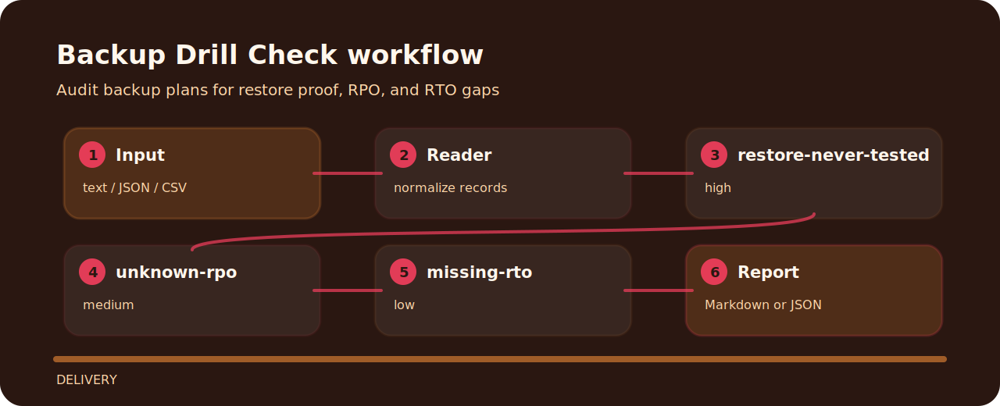

# Backup Drill Check

| Detail | Value |
| --- | --- |
| Area | delivery |
| Entry | `backup-drill-check` |
| Input | plain text |
| Output | terminal findings, optional JSON |


## Where it helps

Audit backup plans for restore proof, RPO, and RTO gaps. It keeps the review small: one input file, a short list of findings, and enough context to fix the line that caused the warning.

## How the check reads



## Signals

- `restore-never-tested` - restore test is missing (high); Schedule and record a restore drill..
- `unknown-rpo` - RPO is not defined (medium); Define maximum acceptable data loss..
- `missing-rto` - RTO is not defined (low); Define target recovery time and owner..

## Local check

```bash
git clone https://github.com/mertefekurt/backup-drill-check.git
cd backup-drill-check
python -m pip install -e ".[dev]"
backup-drill-check examples/sample.txt
```
